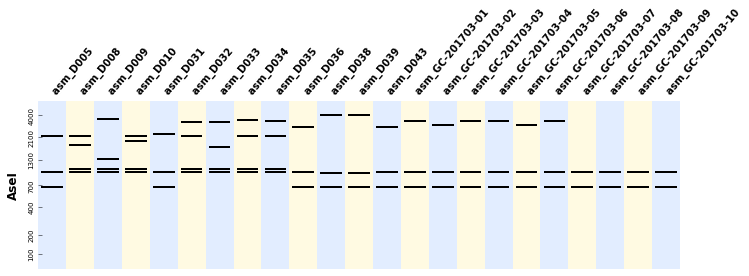

BandWitch Documentation
==========================

Bandwitch is a Python library implementing algorithms to select digestions for
the verification or identification of DNA constructs. It solves the following
problems:

- Given a set of construct, find a digestion that will produce *nice* band patterns
  for all the constructs at once (the conditions for *nice* patterns being
  set by the user.
- Given a set of constructs, find a digestion that will give

In these problems, a *digestion* can contain one or more enzymes depending on the settings.
If one digestion is not enough to solve the problem, BandWitch will find two or more
digestions which collectively solve the problem, i.e. cover the conditions for all
the constructs.

Installation
-------------

You can install DnaCauldron through PIP

.. code:: shell

    sudo pip install bandwitch

Alternatively, you can unzip the sources in a folder and type

.. code:: shell

    sudo python setup.py install

Usage
------

Say you have a list of constructs

First load these files as a dictionary of the form ``{construct_name: sequence}``
where ``sequence`` is simply a string of an ATGC sequence.

Next we use BioPython to make a list of ~60 enzymes whose restriction site has
six basepairs and and who have at least three known providers:

.. code:: python

    from Bio import Restriction
    enzymes = [str(e) for e in Restriction.CommOnly
               if (e.size==6) and (len(e.supplier_list()) > 2)]

**Scenario 1:** Suppose that we want digestion(s) that will yield between 2 and
3 bands in the central zone of the migration ladder. We first write a solver
that implements this condition:

.. code:: python

    from bandwitch import IdealDigestionProblem
    class MyIdealDigestionProblem(IdealDigestionsProblem):
        def migration_pattern_is_ideal(self, migration):
            """Are there 2-3 bands between 30% and 70% of the migration span?"""
            min_migration = 0.7 * self.migration_min + 0.3 * self.migration_max
            max_migration = 0.3 * self.migration_min + 0.7 * self.migration_max
            bands_in_central_zone = [band for band in migration
                                     if min_migration <= band <= max_migration]
            return 2 <= len(bands_in_central_zone) <= 3

Next we create an instance of this problem. We provide the construct sequences,
the ladder used, the maximum number of enzymes per digestion, and we ask for a
solution:

.. code:: python

    from bandwitch import LADDER_100_to_4k
    problem = MyIdealDigestionsProblem(constructs, enzymes, linear=False,
                                       ladder=LADDER_100_to_4k,
                                       max_enzymes_per_digestion=2)
    selected_digestions = problem.select_digestions()
    print selected_digestions

This will return a list of digestions, each containing one or more enzymes, e.g.
``[('Xba', 'EcoRI'), ('AseI',)]``.

**Scenario 2:** Now suppose that we want to select digestion(s) that produce
distinct patterns for the different constructs, so that each construct can be
clearly identified from its digestion pattern(s). We will consider that two bands
in two different patterns are different if their migration distance is more than
5% of the ladder's migration span. Here is the code to solve the problem:

.. code:: python

    from bandwitch import SeparatingDigestionsProblem
    problem = SeparatingDigestionsProblem(sequences, enzymes, linear=False,
                                              ladder=ladder,
                                              max_enzymes_per_digestion=2,
                                              relative_error=0.05)
    digestions = problem.select_digestions()

**Plotting the results:** the bands created by the digestion(s) can be easily
plotted if you have BandWagon installed:

.. code:: python
    axes = problem.plot_digestions(
        digestions,
        patterns_props={'label_fontdict': {'rotation': 35}}
    )
    axes[0].figure.savefig("digestion_patterns.png", bbox_inches="tight")

Here is an example result in the case of scenario 1:

Contribute
----------

BandWitch is an open-source library originally written at the
Edinburgh Genome Foundry by Zulko_. It is released on Github_ under the MIT
licence (¢ Edinburgh Genome Foundry), everyone is welcome to contribute.

.. raw:: html

       <a href="https://twitter.com/share" class="twitter-share-button"
       data-text="Bandwitch - Digestion enzyme selection with Python" data-size="large" data-hashtags="Bioprinting">Tweet
       </a>
       
       <iframe src="http://ghbtns.com/github-btn.html?user=Edinburgh-Genome-Foundry&repo=bandwitch&type=watch&count=true&size=large"
       allowtransparency="true" frameborder="0" scrolling="0" width="152px" height="30px" margin-bottom="30px"></iframe>

.. toctree::
    :hidden:
    :maxdepth: 3

    self

.. toctree::
    :hidden:
    :caption: Reference
    :maxdepth: 3

    ref

.. _Zulko: https://github.com/Zulko/
.. _Github: https://github.com/EdinburghGenomeFoundry/bandwitch
.. _PYPI: https://pypi.python.org/pypi/bandwitch
